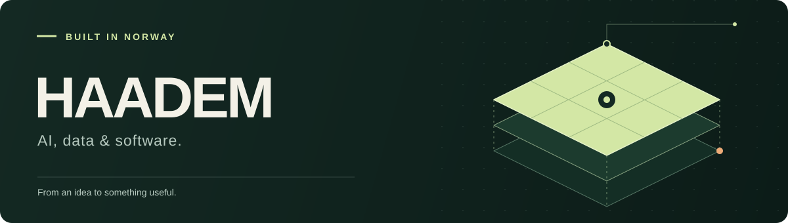
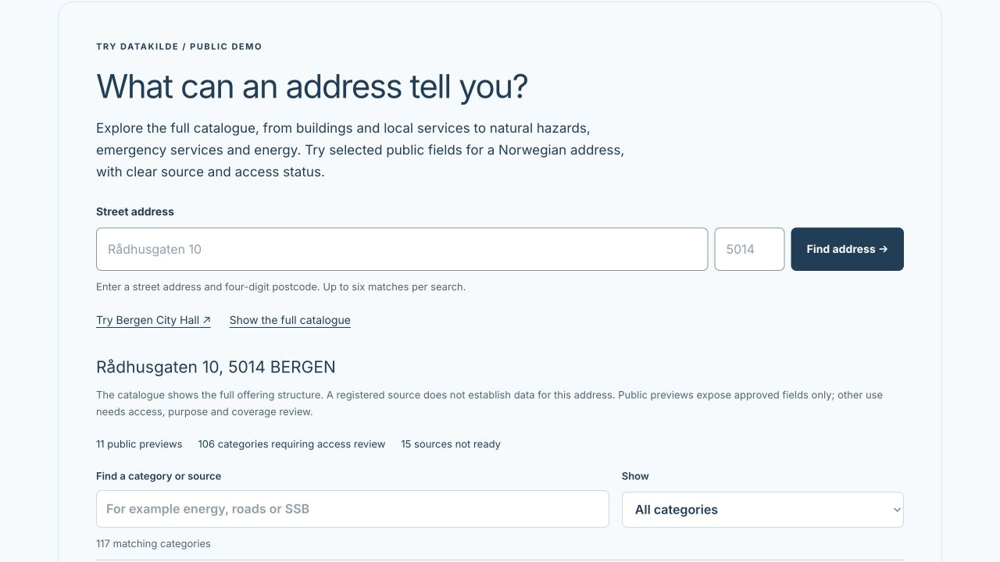

# Hi, I’m Sven.

Developer and entrepreneur based in Norway. I build useful products with AI, data, and modern software—from early prototypes to production systems.

Founder of **[Approach](https://approach.no/en)** and co-founder of **[Aeda](https://aeda.no)**. My work connects product development, machine learning, and the infrastructure that brings them together.

## What I’m building

| Project | Focus |
| :--- | :--- |
| **[Approach](https://approach.no/en)** | Product development, AI, and technical direction. |
| **[Aeda](https://aeda.no)** | Data sharing and enrichment for better analytics. |
| **[ProsjektKlar](https://prosjektklar.no/en)** · at Approach | Building-project preparation, from property data to project drafts. |
| **[Datakilde](https://datakilde.no)** · at Approach | Norwegian building and property data through an API. |

## Try Datakilde

Look up a Norwegian address—or try the **Bergen City Hall** example—to explore selected public data, browse the data catalogue, and inspect the JSON response.

**[Try the demo at datakilde.no →](https://datakilde.no/#api-demo)** · **[Try it on Approach (English) →](https://approach.no/en/datakilde#api-demo)**

*Bergen City Hall example in the English demo. No sign-in required; extended API usage and restricted fields require an agreement.*

## Tools I work with

| Area | Stack |
| :--- | :--- |
| Languages | Python · Go · TypeScript / JavaScript · C / C++ · C# |
| AI & data | PyTorch · TensorFlow · Databricks · Apache Spark · MLOps |
| Cloud & infrastructure | AWS · Google Cloud · Azure · Docker · Kubernetes · Terraform |
| Architecture | Distributed systems · Event-driven systems · gRPC · REST · GraphQL |

<strong>Recent GitHub activity</strong>

Public activity appears here when available. You can also browse my [repositories](https://github.com/Haadem?tab=repositories) and [stars](https://github.com/Haadem?tab=stars).

<!--RECENT_ACTIVITY:start-->
<!--RECENT_ACTIVITY:end-->

<!--RECENT_ACTIVITY:last_update-->
Updated 23 Sep 2026 UTC
<!--RECENT_ACTIVITY:last_update_end-->

---

Have something in mind? **[Let’s build it →](https://approach.no/en)**
